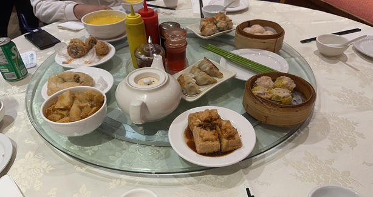
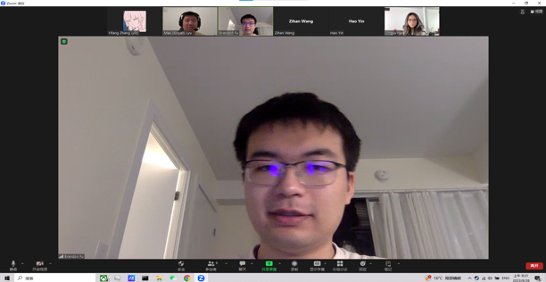

# AudioQR Management Solution/Room Three
> _Note:_ This document will evolve throughout your project. You commit regularly to this file while working on the project (especially edits/additions/deletions to the _Highlights_ section). 
 > **This document will serve as a master plan between your team, your partner and your TA.**

## Product Details
 
#### Q1: What is the product?

 * Our product is an AudioQR Management Solution - an audio system for park guides and its management system based on QR code distribution. We are partnering with John Leadston, a Resident Business Analyst at the Ontario Cabinet Office who has worked with Ontario Park for a long time.
 * John told us that he was hoping our product could replace some physical information boards at the park, which are expensive and manpower-consuming to maintain and update, and are not friendly for people who are visually impaired. Also, sometimes people would need to line up in front of information desks for simple questions. Our product is expected to increase the accessibility of guiding information at parks and to allow more cost-efficient and easier management for administrators.
 * To solve the problem, we plan to launch a website with the potential for future expansion into a mobile app as needed. Our website would allow administrators to easily create web pages linked with QR codes. They can add and edit audio content on the website. There will also be an audio repository where audio files can be edited. By scanning the QR code and accessing the website, visitors would be able to access the audio content and some descriptive photos. They will also be able to playback the audio.
 * Some examples of common use cases would be:
   1. When someone walks into parks, historic sites, etc., they would be able to quickly access to guide audio by scanning QR codes on the benches, trees, etc...
   2. Our website gives admin the ability to update audio content based on the current seasonal themes, when winter comes, the audio can be switched to Christmas.
 * Below is the link to our prototype made with Figma:
   * https://www.figma.com/file/SvfwnclDHxdwv8jXEwm8WI/project-24-ontario-parks-T?type=design&node-id=0%3A1&mode=design&t=XkYAJebEukb7CbmU-1
 * Below is a simple diagram that shows the structure of our project:

 

#### Q2: Who are your target users?

* 	The visitors who come to visit Ontario Parks
* 	Naturalists doing research at the park
* 	Park staff who work and maintain the park
* 	Park administrators from Cabinet Office / Ontario Parks/ Ontario Public Service.
 
#### Q3: Why would your users choose your product? What are they using today to solve their problem/need?

 * Our product provides convenient access to audio guides for visitors of the park and provides a user-friendly platform for park administrators to manage audio guide files. This would be a great step for Ontario parks to use technology to continue enhancing visitor experience. Having a website like this also provides the possibility to offer additional features and convenience in the future.
 * Some detailed benefits include: Firstly, our product saves time. Traditionally, parks have information boards that display the information our website is showing. By scanning the QR code, visitors can easily access guiding information on the website instead of spending time looking around to find information boards at the park. By simplifying and centralizing the process of managing audio content, admins can also save lots of time. Secondly, this website increases accessibility for visually impaired users, and illiterate users and even helps those whose first language is not English (if translation capability is implemented). What’s more, our platform could allow park administrators to see how many people have scanned certain QR codes. This provides insights into visitor preferences, which could be used to improve the park experience. This was not possible with traditional information boards.

#### Q4: What are the user stories that make up the Minumum Viable Product (MVP)?

 * As a tourist in the park, I want to scan the QR code that I saw next to a pond, in order to listen to a recorded introduction about it.

   * Acceptance Criteria:
     * For users who scan QR codes around the park, each QR code leads to a webpage that plays a recorded audio.

 * As a naturalist who found a pair of ospreys nesting next to the river, I want to record and post an introduction about them, in order to introduce them to tourists.
	
   * Acceptance Criteria:
     * Admin can upload recordings, and create webpage and QR code for new locations easily through admin webpage.
     * The webpage should have a straightforward and easy-to-use user interface.

 * As a park warden working at the park, I want to post a QR code that leads to a recording next to the entrance of the trail, in order to provide voice guidance and information to tourists who will enter the trail.

   * Acceptance Criteria:
     * The system needs to generate a QR code and its corresponding audio-playing page for different locations.

 * As a park interpreter working at the park, since the season changed, I want to replace some audio at certain locations in the park, in order to make the contents better suit the current season.

   * Acceptance Criteria:
     * Admin can choose from the audio repository and replace audio as they wish.

 * As a manager of the park, I want to easily manage audios for each location, in order to account for new events and changes that occurred in the park.

   * Acceptance Criteria:
     * The webpage needs a location and audio management page.
     * Admin is able to create, delete, and replace both audio and locations.

#### Q5: Have you decided on how you will build it? Share what you know now or tell us the options you are considering.

> Short (1-2 min' read max)
 * What is the technology stack? Specify languages, frameworks, libraries, PaaS products or tools to be used or being considered.
   * REST is our framework, and it will take care of both the frontend and backend of the website. We will be using a relational database, which will be implemented using SQL. Based on a more detailed structure design later on, we will select a suitable and not too complicated database (e.g. mySQL) to meet the client's requirements. 
 * How will you deploy the application?
   * We will need to set up a server to host our website, ill configure and set up a relational database system to store and manage our data, and also a domain name that serves as the address
 * Describe the architecture - what are the high-level components or patterns you will use? Diagrams are useful here.
   * We are trying to use MVC, we will talk more about the patterns in the future meeting if MVC needs to be changed
 * Will you be using third-party applications or APIs? If so, what are they?
   * Currently, we might use RESTful API

----
## Intellectual Property Confidentiality Agreement 
> Note this section is **not marked** but must be completed briefly if you have a partner. If you have any questions, please ask on Piazza.
>  
**By default, you own any work that you do as part of your coursework.** However, some partners may want you to keep the project confidential after the course is complete. As part of your first deliverable, you should discuss and agree upon an option with your partner. Examples include:
1. You can share the software and the code freely with anyone with or without a license, regardless of domain, for any use.
2. You can upload the code to GitHub or other similar publicly available domains.
3. You will only share the code under an open-source license with the partner but agree to not distribute it in any way to any other entity or individual. 
4. You will share the code under an open-source license and distribute it as you wish but only the partner can access the system deployed during the course.
5. You will only reference the work you did in your resume, interviews, etc. You agree to not share the code or software in any capacity with anyone unless your partner has agreed to it.

**Your partner cannot ask you to sign any legal agreements or documents pertaining to non-disclosure, confidentiality, IP ownership, etc.**

Briefly describe which option you have agreed to.
----
On the initial project proposal, it has mentioined that students can publish source code (e.g., on GitHub), design, and the software. We have emailed our partner for reconfirmation, but have not yet received a reply as of the day we submit our D1. We will update once we get a response.

## Teamwork Details

#### Q6: Have you met with your team?

We had a meal together at Chinatown and discussed what courses we had this year, what we thought about this course, and what we were expecting from the project we were assigned to. We also talked about our hobbies and some of our daily routines.

This is just a screenshot from a meeting we had. We just finished discussing with John, our partner, about what we have done for D1, and what designs John is expecting to see. We had a great meeting with John XD.

* Fun fact about our members?
  * Yifang writes online fictions, he also knows how to compose and arrange electronic music.
  * Zihan, Yuhan, Hao are all cat people.
  * Jingyu‘s favorite movie is Charlie and the Chocolate Factory

#### Q7: What are the roles & responsibilities on the team?

Overall, we all choose our roles based on our interests and previous experiences.

1. Xinyan Lyu, Communicate/front-end developer
* I am responsible for communicating and writing emails to partners and other people outside the team, and I will be contributing mostly to the front end of the project. I am currently learning to do web app development.
2. Yifang Zhang, Project manager/full-stack developer(mainly database)
* I am responsible for managing the project, and I will be contributing to most parts of the project, including frontend, backend, and database. 
3. Zihan Wang, UI/UX designer/full-stack developer
* I am responsible for the user interface and user experience design. Also, I will work on both front and backend development for our website.
4. Hao Yin, Documentarian/ database developer/full-stack developer.
* I am responsible for re-writing meeting minutes, and contributing to most parts of the database and most of the work on frontend.
5. Yuhan Fu, full-stack developer / Documentarian 
* I am responsible for contributing to most web-related parts of the project, including frontend, and backend. Also, I will do Document Management for the group including repo meeting minutes and other team information.
6. Jingyu He, Full-stack Developer/ Product Manager
* I will contribute to both the frontend and backend development of the website. Also, as the product manager, I am responsible of overseeing the end-to-end product development process and defining product goals

#### Q8: How will you work as a team?

Describe meetings (and other events) you are planning to have. 
 * When and where? Recurring or ad hoc? In-person or online?
    * Our daily communication within the team is done through group chat, where we can share problems and thoughts promptly. We plan on having recurring in-person meetings every week throughout this term to discuss progress and identify blockers. However, during the week, if we need to work together on a certain part of the project, we usually plan more in-person meetings. Also, we always have ad-hoc online meetings when something urgent needs to be discussed.
 * What's the purpose of each meeting?
    * The purpose of each of our meetings includes planning the project, providing updates on progress, discussing problems, gathering feedback, and so on. We will also have regular code review sessions to make sure the project and our teammates are on the right track.

 For the rest of the term, we have planned to have recurring partner meetings every Thursday 9-10 AM. As of Sep.28th, we already had 2 meetings with our partner, and below are the details:
 * September 23, 2023. (First Meeting)
    * We are introduced to each member with our partner and the partner illustrates the working experience. Partner introduced ideas about the QR code, and what he wants in while the user scans the QR code. When the partner's son fixes the engine, once he scans the QR code on the engine, there is detailed information on how to do the basic maintenance of the engine. Therefore, He tells us what is the advantage and what he wants of the QR code of the project. Such as replacing the traditional information board which cost a lot of money to do the maintenance and which was located around the park, reducing the waiting time in the customer center, and translating language. 
    * We are sharing the information of a minimum viable product whose host could do the following thinking: Replacing the old audio for each QR code; Deleting the old audio and QR code; Searching the QR code; and Adding the QR code. Based on the different seasons, the host could edit the audio and update the picture.
On the user side, scan the QR code with their device to access the webpage which plays the corresponding audio. 
 * September 28, 2023. (Second Meeting)
    * We illustrated and showed our project by Figma with our partner. Which contains only the basic functionalities of the project. We also share the permission with our partner. He can log in to our Figma and leave comments for us to review his requirements. Therefore, we can edit the Figma and future codes directly to fulfill implementation.
He commended the quick and easy-use design of our prototype and encouraged us to keep the final product simple. We also discussed some future features, such as mapping the visitor and showing them where they are.
    * He commended the quick and easy-use design of our prototype and encouraged us to keep the final product simple. We also discussed some future features, such as mapping the visitor and showing them where they are.  

  
#### Q9: How will you organize your team?

List/describe the artifacts you will produce in order to organize your team.       

 * Artifacts can be To-Do lists, Task boards, schedule(s), meeting minutes, etc.
 * We want to understand:
   * How do you keep track of what needs to get done? (You must grant your TA and partner access to systems you use to manage work)
      * We will have a task board set up in Discord, tasks on the board will mostly be pre-assigned to team members already, but if there is some work that is not clear which subteam should be responsible for, we might just put it on the task board as well, for anyone who might want to finish it. Also, anyone can help other members with their tasks, if they have free time. 
   * **How do you prioritize tasks?**
      * We would prioritize tasks that other parts of our project highly depend on. For example, we will consider working on the database and API first, and then the backend.
   * How do tasks get assigned to team members?
      * Tasks will be assigned directly to the team member(s) that are responsible for them. A frontend task will be assigned to a member that works on the frontend, and so on.
   * How do you determine the status of work from inception to completion?
      * We just check if that part of work does not have obvious and serious bugs. As long as that part of the work satisfies the requirements, and works fine with other parts of the project, we would consider the work to be done.

#### Q10: What are the rules regarding how your team works?

**Communications:**
 * What is the expected frequency? What methods/channels will be used?
     * We are expected to meet with each other at least three times a week, one together with our partner, one at tutorial, and the other time we work together offline. If some of us cannot work offline, we will open up a Zoom room, or use a Discord server to communicate with each other.
 * If you have a partner project, what is your process for communicating with your partner?
     * The basic process is that we meet with our partner every Thursday for about 1 hour, talk about our progress, ask about some problems we have, and ask our partner what else he might be looking forward to seeing. Other than that, if we encounter any problems, we will email our partner directly.

**Collaboration: (Share your responses to Q8 & Q9 from A1)**
 * How are people held accountable for attending meetings, completing action items? Is there a moderator or process?
     * Basically, our way is very simple, which is to simply message or call the person who is falling behind. Whenever someone is not showing up at a meeting, falling behind on progress, or not completing a requirement, we would call that person directly to check on his situation. If things become really difficult for a member (which we hope does not happen), we will have a careful discussion and offer support that is possible.
 * How will you address the issue if one person doesn't contribute or is not responsive?
     * Hopefully, we will never meet this issue, but if this happens, we will discuss such kind of problem seriously. We will encourage our members to get back on track, motivate them to continue on the project and be fairly nice to him. However, in the worst case, if no effects are seen, we might discuss with David or one of the TAs to address this issue and try to find a final solution.
