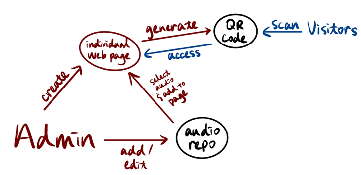

# Group 24 Deliverable 2 Group Report

### Summary of software

Our product is an Audio QR Management Solution - an audio system for park guides and its management system based on QR code distribution. We are partnering with John Leadston, a Resident Business Analyst at the Ontario Cabinet Office who has worked with Ontario Park for a long time.

Although there was previously another implementation of a similar project done by Michele Massa and her team, who was taking CSC301, with the same partner, John Leadston, and some parts of our project may reference this previous implementation, We are rebuilding the project for a more expandable solution, and fits different user stories.

### How we divide the project

We decided to implement the software as a web app, which allows park visitors to have access to the audio most conveniently. We decided to divide the project’s development to three parts: frontend, backend, and database.

We decided to divide the project in this way because these are the most basic components of a web app. Also, our group consists of members with different knowledge, skills, and capabilities. We have exactly two people capable for each of the three subjects.

### Responsibility of each subgroup

The Frontend Team (Subteam 24.1): specializes in creating user-friendly interfaces, dynamic webpages, and an intuitive admin frontend. Their expertise lies in crafting visually appealing designs and seamless interactions, ensuring an engaging experience for both visitors and administrators using our Audio QR Management Solution. They focus on enhancing user accessibility and system management, making the interface intuitive for all users.

The Backend Team (Subteam 24.2): specializes in developing a basic web app that includes basic authentication and audio management. They focus on efficient data communication and implement intricate processing logic, ensuring quick and precise handling of user requests. Their work is fundamental to the system's functionality and responsiveness.

The Database Team (Subteam 24.3): is responsible for designing and managing a secure and comprehensive database. They organize audio files, user data, and essential resources, ensuring seamless data accessibility. By developing a sophisticated database structure, they provide a reliable foundation for the entire system, enabling efficient storage and retrieval of information.
